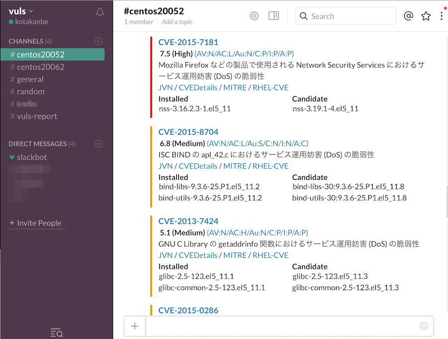

# Vuls: VULnerability Scanner

[](http://goo.gl/forms/xm5KFo35tu)

Vulnerability scanner for Linux, agentless, written in golang.

[README in English](https://github.com/future-architect/vuls/blob/master/README.md)  
Slackチームは[こちらから](http://goo.gl/forms/xm5KFo35tu)参加できます。(日本語でオッケーです)

[](https://asciinema.org/a/bazozlxrw1wtxfu9yojyihick)




----

# Abstract

毎日のように発見される脆弱性の調査やソフトウェアアップデート作業は、システム管理者にとって負荷の高いタスクである。
プロダクション環境ではサービス停止リスクを避けるために、パッケージマネージャの自動更新機能を使わずに手動更新で運用するケースも多い。
だが、手動更新での運用には以下の問題がある。
- システム管理者がNVDなどで新着の脆弱性をウォッチし続けなければならない
- サーバにインストールされているソフトウェアは膨大であり、システム管理者が全てを把握するのは困難
- 新着の脆弱性がどのサーバに該当するのかといった調査コストが大きく、漏れる可能性がある


Vulsは上に挙げた手動運用での課題を解決するツールであり、以下の特徴がある。
- システムに関係ある脆弱性のみ教えてくれる
- その脆弱性に該当するサーバを教えてくれる
- 自動スキャンのため脆弱性検知の漏れを防ぐことができる
- CRONなどで定期実行、レポートすることで脆弱性の放置を防ぐことできる


----

# Main Features

- Linuxサーバに存在する脆弱性をスキャン
    - Ubuntu, Debian, CentOS, Amazon Linux, RHELに対応
    - クラウド、オンプレミス、Docker
- OSパッケージ管理対象外のミドルウェアをスキャン
    - プログラミング言語のライブラリやフレームワーク、ミドルウェアの脆弱性スキャン
    - CPEに登録されているソフトウェアが対象
- エージェントレスアーキテクチャ
    - スキャン対象サーバにSSH接続可能なマシン1台にセットアップするだけで動作
- 設定ファイルのテンプレート自動生成
    - CIDRを指定してサーバを自動検出、設定ファイルのテンプレートを生成
- EmailやSlackで通知可能（日本語でのレポートも可能）
- 付属するTerminal-Based User Interfaceビューアでは、Vim風キーバインドでスキャン結果を参照可能

----

詳細は[README in English](https://github.com/future-architect/vuls/blob/master/README.md) を参照

# レポートの日本語化

- JVNから日本語の脆弱性情報を取得
    ```
    $ go-cve-dictionary fetchjvn -help
    fetchjvn:
            fetchjvn [-dump-path=$PWD/cve] [-dpath=$PWD/vuls.sqlite3] [-week] [-month] [-entire]

      -dbpath string
            /path/to/sqlite3/DBfile (default "$PWD/cve.sqlite3")
      -debug
            debug mode
      -debug-sql
            SQL debug mode
      -dump-path string
            /path/to/dump.json (default "$PWD/cve.json")
      -entire
            Fetch data for entire period.(This operation is time-consuming) (default: false)
      -month
            Fetch data in the last month (default: false)
      -week
            Fetch data in the last week. (default: false)

    ```

- すべての期間の脆弱性情報を取得(1時間以上かかる)
    ```
    $ go-cve-dictionary fetchjvn -entire
    ```

- 直近1ヶ月間に更新された脆弱性情報を取得(1分未満)
    ```
    $ go-cve-dictionary fetchjvn -month
    ```

- 直近1週間に更新された脆弱性情報を取得(1分未満)
    ```
    $ go-cve-dictionary fetchjvn -week
    ```

- 脆弱性情報の自動アップデート  
Cronなどのジョブスケジューラを用いて実現可能。  
-week オプションを指定して夜間の日次実行を推奨。


## スキャン実行

```
$ vuls scan -lang=ja
```
Scan時にlang=jaを指定すると脆弱性レポートが日本語になる  
slack, emailは日本語対応済み TUIは日本語表示未対応

