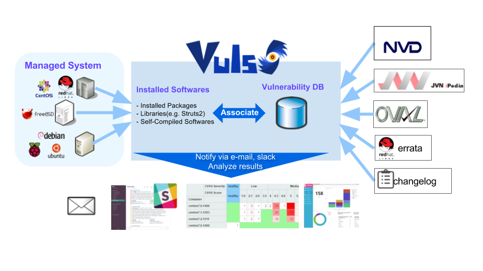
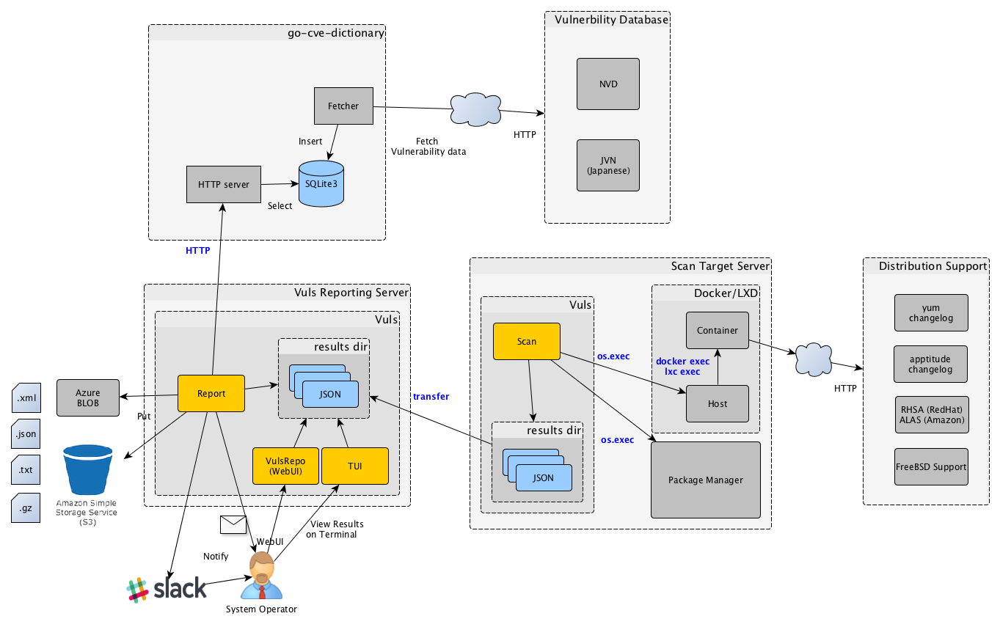
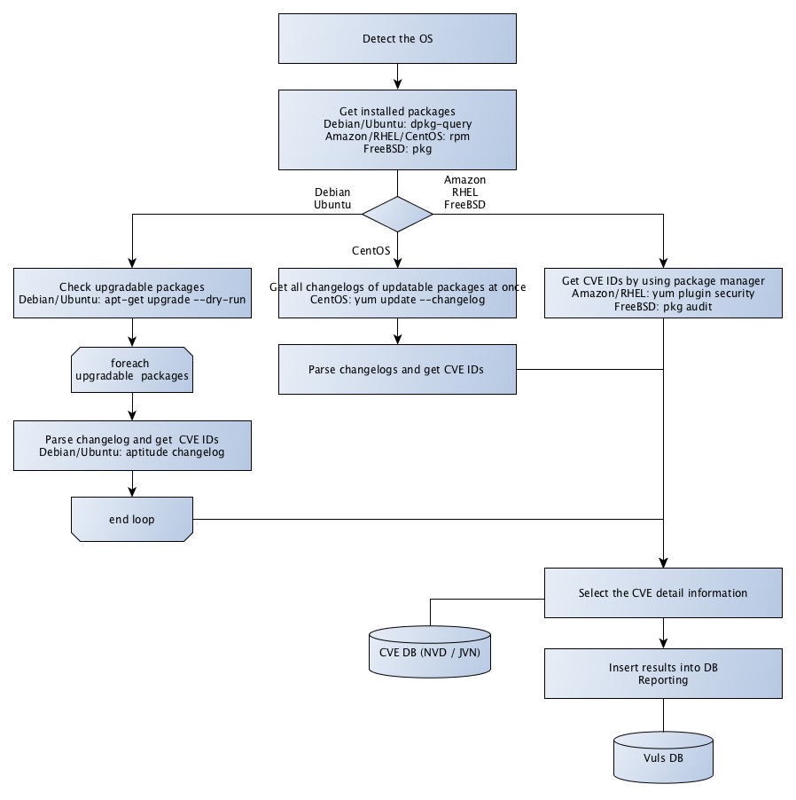

# Vuls: VULnerability Scanner

[](http://goo.gl/forms/xm5KFo35tu)
[](https://github.com/future-architect/vuls/blob/master/LICENSE.txt)
[](https://travis-ci.org/future-architect/vuls)


  

Vulnerability scanner for Linux/FreeBSD, agentless, written in golang.  
We have a slack team. [Join slack team](http://goo.gl/forms/xm5KFo35tu)  
Twitter: [@vuls_en](https://twitter.com/vuls_en)

[README 日本語](https://github.com/future-architect/vuls/blob/master/README.ja.md)  
[README in French](https://github.com/future-architect/vuls/blob/master/README.fr.md)  



[](https://asciinema.org/a/3y9zrf950agiko7klg8abvyck)


----

# TOC

Table of Contents
=================

   * [Vuls: VULnerability Scanner](#vuls-vulnerability-scanner)
   * [TOC](#toc)
   * [Abstract](#abstract)
   * [Main Features](#main-features)
   * [What Vuls Doesn't Do](#what-vuls-doesnt-do)
   * [Setup Vuls](#setup-vuls)
   * [Tutorial](#tutorial)
   * [Tutorial: Local Scan Mode](#tutorial-local-scan-mode)
      * [Step1. Launch CentOS7](#step1-launch-centos7)
      * [Step2. Install requirements](#step2-install-requirements)
      * [Step3. Deploy go-cve-dictionary](#step3-deploy-go-cve-dictionary)
      * [Step4. Deploy goval-dictionary](#step4-deploy-goval-dictionary)
      * [Step5. Deploy Vuls](#step5-deploy-vuls)
      * [Step6. Configuration](#step6-configuration)
      * [Step7. Check config.toml and settings on the server before scanning](#step7-check-configtoml-and-settings-on-the-server-before-scanning)
      * [Step8. Start Scanning](#step8-start-scanning)
      * [Step9. Reporting](#step9-reporting)
      * [Step10. TUI](#step10-tui)
      * [Step11. Web UI](#step11-web-ui)
   * [Tutorial: Remote Scan Mode](#tutorial-remote-scan-mode)
      * [Step1. Launch new Ubuntu Linux](#step1-launch-new-ubuntu-linux)
      * [Step2. Enable to SSH from localhost](#step2-enable-to-ssh-from-localhost)
      * [Step3. Configure (config.toml)](#step3-configure-configtoml)
      * [Step4. Check config.toml and settings on the server before scanning](#step4-check-configtoml-and-settings-on-the-server-before-scanning)
      * [Step5. Start Scanning](#step5-start-scanning)
      * [Step6. Reporting](#step6-reporting)
   * [Setup Vuls in a Docker Container](#setup-vuls-in-a-docker-container)
   * [Architecture](#architecture)
      * [A. Scan via SSH Mode (Remote Scan Mode)](#a-scan-via-ssh-mode-remote-scan-mode)
      * [B. Scan without SSH (Local Scan Mode)](#b-scan-without-ssh-local-scan-mode)
      * [Fast Scan and Deep Scan](#fast-scan-and-deep-scan)
         * [Fast Scan](#fast-scan)
         * [Deep Scan](#deep-scan)
   * [Use Cases](#use-cases)
      * [Scan All Servers](#scan-all-servers)
      * [Scan a Single Server](#scan-a-single-server)
      * [Scan Staging Environment](#scan-staging-environment)
   * [Support OS](#support-os)
   * [Usage: Automatic Server Discovery](#usage-automatic-server-discovery)
      * [Example](#example)
   * [Configuration](#configuration)
   * [Usage: Configtest](#usage-configtest)
      * [Fast Scan Mode](#fast-scan-mode)
      * [Deep Scan Mode](#deep-scan-mode)
         * [Dependencies and /etc/sudoers on Target Servers](#dependencies-and-etcsudoers-on-target-servers)
   * [Usage: Scan](#usage-scan)
      * [-deep option](#-deep-option)
      * [-ssh-native-insecure option](#-ssh-native-insecure-option)
      * [-ask-key-password option](#-ask-key-password-option)
      * [Example: Scan all servers defined in config file](#example-scan-all-servers-defined-in-config-file)
      * [Example: Scan specific servers](#example-scan-specific-servers)
      * [Example: Scan via shell instead of SSH.](#example-scan-via-shell-instead-of-ssh)
         * [cron](#cron)
      * [Example: Scan containers (Docker/LXD)](#example-scan-containers-dockerlxd)
         * [Docker](#docker)
         * [LXD](#lxd)
   * [Usage: Report](#usage-report)
      * [How to read a report](#how-to-read-a-report)
         * [Example](#example-1)
         * [Summary part](#summary-part)
         * [Detailed Part](#detailed-part)
      * [Example: Send scan results to Slack](#example-send-scan-results-to-slack)
      * [Example: Put results in S3 bucket](#example-put-results-in-s3-bucket)
      * [Example: Put results in Azure Blob storage](#example-put-results-in-azure-blob-storage)
      * [Example: IgnoreCves](#example-ignorecves)
      * [Example: Add optional key-value pairs to JSON](#example-add-optional-key-value-pairs-to-json)
      * [Example: Use MySQL as a DB storage back-end](#example-use-mysql-as-a-db-storage-back-end)
      * [Example: Use PostgreSQL as a DB storage back-end](#example-use-postgresql-as-a-db-storage-back-end)
      * [Example: Use Redis as a DB storage back-end](#example-use-redis-as-a-db-storage-back-end)
   * [Usage: Scan vulnerabilites of non-OS packages](#usage-scan-vulnerabilites-of-non-os-packages)
   * [Usage: Integrate with OWASP Dependency Check to Automatic update when the libraries are updated (Experimental)](#usage-integrate-with-owasp-dependency-check-to-automatic-update-when-the-libraries-are-updated-experimental)
   * [Usage: TUI](#usage-tui)
      * [Display the latest scan results](#display-the-latest-scan-results)
      * [Display the previous scan results](#display-the-previous-scan-results)
   * [Display the previous scan results using peco](#display-the-previous-scan-results-using-peco)
   * [Usage: go-cve-dictionary on different server](#usage-go-cve-dictionary-on-different-server)
   * [Usage: Update NVD Data](#usage-update-nvd-data)
   * [Usage: goval-dictionary on different server](#usage-goval-dictionary-on-different-server)
   * [Usage: Update OVAL Data](#usage-update-oval-data)
   * [How to Update to the Latest Version](#how-to-update-to-the-latest-version)
   * [Misc](#misc)
   * [Related Projects](#related-projects)
   * [Data Source](#data-source)
   * [Authors](#authors)
   * [Contribute](#contribute)
   * [Change Log](#change-log)
   * [Stargazers over time](#stargazers-over-time)
   * [License](#license)

Created by [gh-md-toc](https://github.com/ekalinin/github-markdown-toc)

----

# Abstract

For a system administrator, having to perform security vulnerability analysis and software update on a daily basis can be a burden.
To avoid downtime in production environment, it is common for system administrator to choose not to use the automatic update option provided by package manager and to perform update manually.
This leads to the following problems.
- System administrator will have to constantly watch out for any new vulnerabilities in NVD(National Vulnerability Database) or similar databases.
- It might be impossible for the system administrator to monitor all the software if there are a large number of software installed in server.
- It is expensive to perform analysis to determine the servers affected by new vulnerabilities. The possibility of overlooking a server or two during analysis is there.


Vuls is a tool created to solve the problems listed above. It has the following characteristics.
- Informs users of the vulnerabilities that are related to the system.
- Informs users of the servers that are affected.
- Vulnerability detection is done automatically to prevent any oversight.
- Report is generated on regular basis using CRON or other methods. to manage vulnerability.


----

# Main Features

- Scan for any vulnerabilities in Linux/FreeBSD Server
    - Supports FreeBSD, Ubuntu, Debian, CentOS, Amazon Linux, RHEL, Oracle Linux and Raspbian
    - Cloud, on-premise, Docker
- High quality scan
    - Vuls uses Multiple vulnerability databases
        - OVAL
        - RHSA/ALAS/ELSA/FreeBSD-SA
        - Changelog
- Fast scan and Deep scan
    - Fast Scan
        - Scan without root privilege
        - Scan with No internet access. (RedHat, CentOS, OracleLinux, Ubuntu, Debian)
        - Almost no load on the scan target server
    - Deep Scan
        - Scan with root privilege
        - Parses the Changelog  
            Changelog has a history of version changes. When a security issue is fixed, the relevant CVE ID is listed.
            By parsing the changelog and analysing the updates between the installed version of software on the server and the newest version of that software
            it's possible to create a list of all vulnerabilities that need to be fixed.
        - Sometimes load on the scan target server
- Remote scan and Local scan
    - Remote Scan
        - User is required to only setup one machine that is connected to other target servers via SSH
    - Local Scan 
        - If you don't want the central Vuls server to connect to each server by SSH, you can use Vuls in the Local Scan mode.
- **Dynamic** Analysis
    - It is possible to acquire the state of the server by connecting via SSH and executing the command
        - Vuls warns when the scan target server was updated the kernel etc. but not restarting it.
- Scan middleware that are not included in OS package management
    - Scan middleware, programming language libraries and framework for vulnerability
    - Support software registered in CPE
- Nondestructive testing
- Pre-authorization is *NOT* necessary before scanning on AWS
    - Vuls works well with Continuous Integration since tests can be run every day. This allows you to find vulnerabilities very quickly.
- Auto generation of configuration file template
    - Auto detection of servers set using CIDR, generate configuration file template
- Email and Slack notification is possible (supports Japanese language)
- Scan result is viewable on accessory software, TUI Viewer on terminal or Web UI ([VulsRepo](https://github.com/usiusi360/vulsrepo)).

----

# What Vuls Doesn't Do

- Vuls doesn't update the vulnerable packages.

----

# Setup Vuls

There are 2 ways to setup Vuls.

- Docker container  
Dockernized-Vuls with vulsrepo UI in it.  
You can run install and run Vuls on your machine with only a few commands.  
see https://github.com/future-architect/vuls/tree/master/setup/docker

- Manually  
Tutorial shows how to setup vuls manually.

----

# Tutorial

To give you an idea of how easy Vuls is to use. 
This tutorial consists of three steps.
1. Tutorial: Local Scan Mode
      - Launch CentOS on AWS
      - Deploy Vuls
      - Scan localhost, Reporting
1. Tutorial: Remote Scan Mode
      - Launch Ubuntu Linux on AWS
      - Scan this Ubuntu from the Vuls you set up earlier

----

# Tutorial: Local Scan Mode

This tutorial will let you scan the vulnerabilities on the localhost with Vuls.   
This can be done in the following steps.  

1. Launch CentOS
1. Install requirements
1. Deploy go-cve-dictionary
1. Deploy goval-dictionary
1. Deploy Vuls
1. Configuration
1. Check config.toml and settings on the server before scanning
1. Scan
1. Reporting
1. TUI(Terminal-Based User Interface)
1. Web UI ([VulsRepo](https://github.com/usiusi360/vulsrepo))

## Step1. Launch CentOS7

- We are using the old AMI for this example
- Add the following to the cloud-init, to avoid auto-update at the first launch.

    ```
    #cloud-config
    repo_upgrade: none
    ```

    - [Q: How do I disable the automatic installation of critical and important security updates on initial launch?](https://aws.amazon.com/amazon-linux-ami/faqs/?nc1=h_ls)

## Step2. Install requirements

Vuls requires the following packages.

- SQLite3, MySQL, PostgreSQL, Redis
- git
- gcc
- GNU Make
- go v1.8.3 or later (The latest version is recommended)
    - https://golang.org/doc/install

```bash
$ ssh centos@52.100.100.100  -i ~/.ssh/private.pem
$ sudo yum -y install sqlite git gcc make wget
$ wget https://storage.googleapis.com/golang/go1.8.3.linux-amd64.tar.gz
$ sudo tar -C /usr/local -xzf go1.8.3.linux-amd64.tar.gz
$ mkdir $HOME/go
```
Add these lines into /etc/profile.d/goenv.sh

```bash
export GOROOT=/usr/local/go
export GOPATH=$HOME/go
export PATH=$PATH:$GOROOT/bin:$GOPATH/bin
```

Set the OS environment variable to current shell
```bash
$ source /etc/profile.d/goenv.sh
```

## Step3. Deploy go-cve-dictionary

[go-cve-dictionary](https://github.com/kotakanbe/go-cve-dictionary)

```bash
$ sudo mkdir /var/log/vuls
$ sudo chown centos /var/log/vuls
$ sudo chmod 700 /var/log/vuls
$
$ mkdir -p $GOPATH/src/github.com/kotakanbe
$ cd $GOPATH/src/github.com/kotakanbe
$ git clone https://github.com/kotakanbe/go-cve-dictionary.git
$ cd go-cve-dictionary
$ make install
```
The binary was built under `$GOPATH/bin`
If the installation process stops halfway, try increasing the instance type of EC2. An out of memory error may have occurred.


Fetch vulnerability data from NVD.  
It takes about 10 minutes (on AWS).  

```bash
$ cd $HOME
$ for i in `seq 2002 $(date +"%Y")`; do go-cve-dictionary fetchnvd -years $i; done
... snip ...
$ ls -alh cve.sqlite3
-rw-r--r--. 1 centos centos  51M Aug  6 08:10 cve.sqlite3
-rw-r--r--. 1 centos centos  32K Aug  6 08:10 cve.sqlite3-shm
-rw-r--r--. 1 centos centos 5.1M Aug  6 08:10 cve.sqlite3-wal
```

## Step4. Deploy goval-dictionary

[goval-dictionary](https://github.com/kotakanbe/goval-dictionary)

```bash
$ mkdir -p $GOPATH/src/github.com/kotakanbe
$ cd $GOPATH/src/github.com/kotakanbe
$ git clone https://github.com/kotakanbe/goval-dictionary.git
$ cd goval-dictionary
$ make install
```
The binary was built under `$GOPATH/bin`
If the installation process stops halfway, try increasing the instance type of EC2. An out of memory error may have occurred.

 Then fetch OVAL data of RedHat since the server to be scanned is CentOS. [README](https://github.com/kotakanbe/goval-dictionary#usage-fetch-oval-data-from-redhat)

```bash
$ goval-dictionary fetch-redhat 7
```

If you want to scan other than CentOS 7, fetch OVAL data according to the OS type and version of scan target server in advance.
- [RedHat, CentOS](https://github.com/kotakanbe/goval-dictionary#usage-fetch-oval-data-from-redhat)
- [Debian](https://github.com/kotakanbe/goval-dictionary#usage-fetch-oval-data-from-debian)
- [Ubuntu](https://github.com/kotakanbe/goval-dictionary#usage-fetch-oval-data-from-ubuntu)
- [Oracle Linux](https://github.com/kotakanbe/goval-dictionary#usage-fetch-oval-data-from-oracle)

## Step5. Deploy Vuls

Launch a new terminal and SSH to the ec2 instance.

```
$ mkdir -p $GOPATH/src/github.com/future-architect
$ cd $GOPATH/src/github.com/future-architect
$ git clone https://github.com/future-architect/vuls.git
$ cd vuls
$ make install
```
The binary was built under `$GOPATH/bin`
If the installation process stops halfway, try increasing the instance type of EC2. An out of memory error may have occurred.

## Step6. Configuration

Create a config file(TOML format).  
```
$ cd $HOME
$ cat config.toml
[servers]

[servers.localhost]
host = "localhost"
port = "local"
```


## Step7. Check config.toml and settings on the server before scanning

```
$ vuls configtest
```

see [Usage: configtest](#usage-configtest)

## Step8. Start Scanning

```
$ vuls scan

... snip ...

One Line Summary
================
localhost       centos7.3.1611  31 updatable packages

```

## Step9. Reporting

View one-line summary

```
$ vuls report -format-one-line-text -cvedb-path=$PWD/cve.sqlite3 -ovaldb-path=$PWD/oval.sqlite3

One Line Summary
================
localhost       Total: 109 (High:35 Medium:55 Low:16 ?:3)       31 updatable packages

```

View short summary

```
$ vuls report -format-short-text

localhost (centos7.3.1611)
==========================
Total: 109 (High:35 Medium:55 Low:16 ?:3)       31 updatable packages

CVE-2015-2806           10.0 HIGH (nvd)
                        Stack-based buffer overflow in asn1_der_decoding in libtasn1 before 4.4 allows
                        remote attackers to have unspecified impact via unknown vectors.
                        ---
                        https://nvd.nist.gov/vuln/detail/CVE-2015-2806
                        https://access.redhat.com/security/cve/CVE-2015-2806 (RHEL-CVE)
                        10.0/AV:N/AC:L/Au:N/C:C/I:C/A:C (nvd)
                        2.6/AV:N/AC:H/Au:N/C:N/I:N/A:P (redhat)
                        https://nvd.nist.gov/vuln-metrics/cvss/v2-calculator?name=CVE-2015-2806
                        3.3/CVSS:3.0/AV:L/AC:L/PR:N/UI:R/S:U/C:N/I:N/A:L (redhat)
                        https://nvd.nist.gov/vuln-metrics/cvss/v3-calculator?name=CVE-2015-2806
                        Confidence: 100 / OvalMatch

... snip ...
````

View full report.

```
$ vuls report -format-full-text | less
localhost (centos7.3.1611)
==========================
Total: 109 (High:35 Medium:55 Low:16 ?:3)       31 updatable packages

CVE-2015-2806
----------------
Max Score               10.0 HIGH (nvd)
nvd                     10.0/AV:N/AC:L/Au:N/C:C/I:C/A:C
redhat                  2.6/AV:N/AC:H/Au:N/C:N/I:N/A:P
redhat                  3.3/CVSS:3.0/AV:L/AC:L/PR:N/UI:R/S:U/C:N/I:N/A:L
CVSSv2 Calc             https://nvd.nist.gov/vuln-metrics/cvss/v2-calculator?name=CVE-2015-2806
CVSSv3 Calc             https://nvd.nist.gov/vuln-metrics/cvss/v3-calculator?name=CVE-2015-2806
Summary                 Stack-based buffer overflow in asn1_der_decoding in libtasn1 before 4.4 allows
                        remote attackers to have unspecified impact via unknown vectors.
Source                  https://nvd.nist.gov/vuln/detail/CVE-2015-2806
RHEL-CVE                https://access.redhat.com/security/cve/CVE-2015-2806
CWE-119 (nvd)           https://cwe.mitre.org/data/definitions/119.html
Package/CPE             libtasn1-3.8-3.el7 -
Confidence              100 / OvalMatch

... snip ...
```

## Step10. TUI

Vuls has Terminal-Based User Interface to display the scan result.

```
$ vuls tui
```


## Step11. Web UI

[VulsRepo](https://github.com/usiusi360/vulsrepo) is a awesome Web UI for Vuls.  
Check it out the [Online Demo](http://usiusi360.github.io/vulsrepo/).

----

# Tutorial: Remote Scan Mode

This tutorial will let you scan the vulnerabilities on the remote host via SSH with Vuls.   
This can be done in the following steps.  

1. Launch new Ubuntu Linux
1. Enable to SSH from localhost
1. Configuration
1. Check config.toml and settings on the server before scanning
1. Scan
1. Reporting

We will use the Vuls server (called localhost) created in the previous tutorial.

## Step1. Launch new Ubuntu Linux

Same like as [Tutorial: Local Scan Mode#Step1. Launch CentOS7](#step1-launch-centos7)  
Launch a new terminal and SSH to the Remote host.  
To add the remote host's Host Key to $HOME/.ssh/known_hosts, you need to log in to the remote host through SSH before scanning.

## Step2. Enable to SSH from localhost

Vuls doesn't support SSH password authentication. So you have to use SSH key-based authentication.  
Create a keypair on the localhost then append the public key to authorized_keys on the remote host.  

- localhost
```bash
$ ssh-keygen -t rsa
```
Copy ~/.ssh/id_rsa.pub to the clipboard.

- Remote Host
```
$ mkdir ~/.ssh
$ chmod 700 ~/.ssh
$ touch ~/.ssh/authorized_keys
$ chmod 600 ~/.ssh/authorized_keys
$ vim ~/.ssh/authorized_keys
```
Paste from the clipboard to `~/.ssh/.authorized_keys`

And also, confirm that the host keys of scan target servers has been registered in the known_hosts of the localhost.
To add the remote host's Host Key to `$HOME/.ssh/known_hosts`, you need to log in to the remote host through SSH before scanning.

- localhost
```
$ ssh ubuntu@172.31.4.82 -i ~/.ssh/id_rsa
```

## Step3. Configure (config.toml)

- localhost
```
$ cd $HOME
$ cat config.toml
[servers]

[servers.ubuntu]
host         = "172.31.4.82"
port        = "22"
user        = "ubuntu"
keyPath     = "/home/centos/.ssh/id_rsa"
```

## Step4. Check config.toml and settings on the server before scanning

```
$ vuls configtest ubuntu
```

see [Usage: configtest](#usage-configtest)

## Step5. Start Scanning

```
$ vuls scan ubuntu
... snip ...

One Line Summary
================
ubuntu  ubuntu16.04     30 updatable packages
```

## Step6. Reporting

See [Tutorial: Local Scan Mode#Step9. Reporting](#step9-reporting)  
See [Tutorial: Local Scan Mode#Step10. TUI](#step10-tui)  
See [Tutorial: Local Scan Mode#Step11. Web UI](#step11-web-ui)

----

# Setup Vuls in a Docker Container

see https://github.com/future-architect/vuls/tree/master/setup/docker

----

# Architecture

## A. Scan via SSH Mode (Remote Scan Mode)


## B. Scan without SSH (Local Scan Mode)

Deploy Vuls to the scan target server. Vuls issues a command to the local host (not via SSH). Aggregate the JSON of the scan result into another server. Since it is necessary to access the CVE database in order to refine the scan result, start go-cve-dictionary in server mode beforehand.
On the aggregation server, you can refer to the scanning result of each scan target server using WebUI or TUI.


[Details](#example-scan-via-shell-instead-of-ssh)

----

## Fast Scan and Deep Scan

### Fast Scan

- Scan without Root Privilege
- Scan with No internet access on some OS.

| Distribution|                             Scan Speed | Need Root Privilege |       OVAL | Need Internet Access <br>on scan tareget|
|:------------|:--------------------------------------:|:-------------------:|:----------:|:---------------------------------------:|
| CentOS      |                                   Fast |　                No |  Supported |                                      No | 
| RHEL        |                                   Fast |　                No |  Supported |                                      No |
| Oracle      |                                   Fast |　                No |  Supported |                                      No |
| Ubuntu      |                                   Fast |　                No |  Supported |                                      No |
| Debian      |                                   Fast |　                No |  Supported |                                      No |
| Raspbian    |1st time: Slow <br> From 2nd time: Fast |                Need |         No |                                    Need |
| FreeBSD     |                                   Fast |　                No |         No |                                    Need |
| Amazon      |                                   Fast |　                No |         No |                                    Need | 


---------

### Deep Scan


| Distribution|                            Scan Speed |       Need Root Privilege |      OVAL | Need Internet Access <br>on scan tareget|
|:------------|:-------------------------------------:|:-------------------------:|:---------:|:---------------------------------------:|
| CentOS      |                                  Slow |　                      No | Supported |                                    Need | 
| RHEL        |                                  Slow |　                    Need | Supported |                                    Need |
| Oracle      |                                  Slow |　                    Need | Supported |                                    Need |
| Ubuntu      |1st time: Slow <br> From 2nd time: Fast|                      Need | Supported |                                    Need |
| Debian      |1st time: Slow <br> From 2nd time: Fast|                      Need | Supported |                                    Need |
| Raspbian    |1st time: Slow <br> From 2nd time: Fast|                      Need |        No |                                    Need |
| FreeBSD     |                                  Fast |　                      No |        No |                                    Need |
| Amazon      |                                  Slow |　                      No |        No |                                    Need |


- On Ubuntu, Debian and Raspbian
Vuls issues `apt-get changelog` for each upgradable packages and parse the changelog.  
`apt-get changelog` is slow and resource usage is heavy when there are many updatable packages on target server.   
Vuls stores these changelogs to KVS([boltdb](https://github.com/boltdb/bolt)).  
From the second time on, the scan speed is fast by using the local cache.

- On CentOS
Vuls issues `yum changelog` to get changelogs of upgradable packages at once and parse the changelog.  
- On RHEL, Oracle, Amazon and FreeBSD
Detect CVE IDs by using package manager.

----

# Use Cases

## Scan All Servers


## Scan a Single Server

web/app server in the same configuration under the load balancer


## Scan Staging Environment

If there is a staging environment with the same configuration as the production environment, you can scan the server in staging environment

----

# Support OS

| Distribution |            Release |
|:-------------|-------------------:|
| Ubuntu       |          12, 14, 16|
| Debian       |             7, 8, 9|
| RHEL         |             5, 6, 7|
| Oracle Linux |             5, 6, 7|
| CentOS       |                6, 7|
| Amazon Linux |                 All|
| FreeBSD      |              10, 11|
| Raspbian     |    Jessie, Stretch |

----


# Usage: Automatic Server Discovery

Discovery subcommand discovers active servers specified in CIDR range, then display the template of config file(TOML format) to terminal.

```
$ vuls discover -help
discover:
        discover 192.168.0.0/24
```

## Example

```
$ vuls discover 172.31.4.0/24
# Create config.toml using below and then ./vuls --config=/path/to/config.toml

[slack]
hookURL      = "https://hooks.slack.com/services/abc123/defghijklmnopqrstuvwxyz"
channel      = "#channel-name"
#channel      = "${servername}"
iconEmoji    = ":ghost:"
authUser     = "username"
notifyUsers  = ["@username"]

[email]
smtpAddr      = "smtp.gmail.com"
smtpPort      = "587"
user          = "username"
password      = "password"
from          = "from@address.com"
to            = ["to@address.com"]
cc            = ["cc@address.com"]
subjectPrefix = "[vuls]"

[default]
#port        = "22"
#user        = "username"
#keyPath     = "/home/username/.ssh/id_rsa"
#cpeNames = [
#  "cpe:/a:rubyonrails:ruby_on_rails:4.2.1",
#]
#ignoreCves = ["CVE-2016-6313"]
#optional = [
#    ["key", "value"],
#]

[servers]

[servers.172-31-4-82]
host         = "172.31.4.82"
#port        = "22"
#user        = "root"
#keyPath     = "/home/username/.ssh/id_rsa"
#cpeNames = [
#  "cpe:/a:rubyonrails:ruby_on_rails:4.2.1",
#]
#ignoreCves = ["CVE-2016-6313"]
#optional = [
#    ["key", "value"],
#]
#[servers.172-31-4-82.containers]
#type = "lxd" # or "docker"
#includes = ["${running}"]
#excludes = ["container_name", "container_id"]
```

You can customize your configuration using this template.

----

# Configuration

- Slack section
    ```
    [slack]
    hookURL      = "https://hooks.slack.com/services/abc123/defghijklmnopqrstuvwxyz"
    channel      = "#channel-name"
    #channel      = "${servername}"
    iconEmoji    = ":ghost:"
    authUser     = "username"
    notifyUsers  = ["@username"]
    ```

    - hookURL : Incoming webhook's URL  
    - channel : channel name.  
    If you set `${servername}` to channel, the report will be sent to each channel.  
    In the following example, the report will be sent to the `#server1` and `#server2`.  
    Be sure to create these channels before scanning.
      ```
      [slack]
      channel      = "${servername}"
      ...snip...

      [servers]

      [servers.server1]
      host         = "172.31.4.82"
      ...snip...

      [servers.server2]
      host         = "172.31.4.83"
      ...snip...
      ```

    - iconEmoji: emoji
    - authUser: username of the slack team
    - notifyUsers: a list of Slack usernames to send Slack notifications.
      If you set `["@foo", "@bar"]` to notifyUsers, @foo @bar will be included in text.  
      So @foo, @bar can receive mobile push notifications on their smartphone.  

- EMail section
    ```
    [email]
    smtpAddr      = "smtp.gmail.com"
    smtpPort      = "587"
    user          = "username"
    password      = "password"
    from          = "from@address.com"
    to            = ["to@address.com"]
    cc            = ["cc@address.com"]
    subjectPrefix = "[vuls]"
    ```

- Default section
    ```
    [default]
    #port        = "22"
    #user        = "username"
    #keyPath     = "/home/username/.ssh/id_rsa"
    #cpeNames = [
    #  "cpe:/a:rubyonrails:ruby_on_rails:4.2.1",
    #]
    #ignoreCves = ["CVE-2016-6313"]
    #optional = [
    #    ["key", "value"],
    #]
    ```
    Items of the default section will be used if not specified.

- servers section
    ```
    [servers]

    [servers.172-31-4-82]
    host         = "172.31.4.82"
    #port        = "22"
    #user        = "root"
    #keyPath     = "/home/username/.ssh/id_rsa"
    #cpeNames = [
    #  "cpe:/a:rubyonrails:ruby_on_rails:4.2.1",
    #]
    #ignoreCves = ["CVE-2016-6314"]
    #optional = [
    #    ["key", "value"],
    #]
    #[servers.172-31-4-82.containers]
    #type = "lxd" # or "docker"
    #includes = ["${running}"]
    #excludes = ["container_name", "container_id"]
    ```

    You can overwrite the default value specified in default section.  

    - host: IP address or hostname of target server
    - port: SSH Port number
    - user: SSH username
    - keyPath: SSH private key path
    - cpeNames: see [Usage: Scan vulnerability of non-OS package](#usage-scan-vulnerability-of-non-os-package)
    - ignoreCves: CVE IDs that will not be reported. But output to JSON file.
    - optional: Add additional information to JSON report.
    - containers: see [Example: Scan containers (Docker/LXD)(#example-scan-containers-dockerlxd)

    Vuls supports two types of SSH. One is external command. The other is native go implementation. For details, see [-ssh-native-insecure option](#-ssh-native-insecure-option)

    Multiple SSH authentication methods are supported.  
    - SSH agent
    - SSH public key authentication (with password and empty password)
    Password authentication is not supported.

----

# Usage: Configtest

```
$ vuls configtest --help
configtest:
        configtest
                        [-deep]
                        [-config=/path/to/config.toml]
                        [-log-dir=/path/to/log]
                        [-ask-key-password]
                        [-ssh-native-insecure]
                        [-containers-only]
                        [-timeout=300]
                        [-debug]

                        [SERVER]...
  -ask-key-password
        Ask ssh privatekey password before scanning
  -config string
        /path/to/toml (default "/Users/kotakanbe/go/src/github.com/future-architect/vuls/config.toml")
  -containers-only
        Test containers only. Default: Test both of hosts and containers
  -debug
        debug mode
  -deep
        Config test for deep scan mode
  -http-proxy string
        http://proxy-url:port (default: empty)
  -log-dir string
        /path/to/log (default "/var/log/vuls")
  -ssh-native-insecure
        Use Native Go implementation of SSH. Default: Use the external command
  -timeout int
        Timeout(Sec) (default 300)

```

The configtest subcommand checks whether vuls is able to connect via SSH to servers/containers defined in the config.toml

  ## Fast Scan Mode

| Distribution |            Release | Requirements |
|:-------------|-------------------:|:-------------|
| Ubuntu       |          12, 14, 16| - |
| Debian       |             7, 8, 9| reboot-notifier|
| CentOS       |                6, 7| - |
| Amazon       |                All | - |
| RHEL         |            5, 6, 7 | - | 
| Oracle Linux |            5, 6, 7 | - |
| FreeBSD      |             10, 11 | - |
| Raspbian     |    Jessie, Stretch | - |

## Deep Scan Mode

Some dependent packages are needed in Deep Scan Mode.
The configtest subcommand with --deep flag checks whether the packages are installed on the scan target server and also check /etc/sudoers

### Dependencies and /etc/sudoers on Target Servers

In order to scan with deep scan mode, the following dependencies are required, so you need to install them manually or with tools such as Ansible.

| Distribution |            Release | Requirements |
|:-------------|-------------------:|:-------------|
| Ubuntu       |          12, 14, 16| -            |
| Debian       |             7, 8, 9| aptitude, reboot-notifier     |
| CentOS       |                6, 7| yum-plugin-changelog, yum-utils |
| Amazon       |                All | yum-plugin-changelog, yum-utils |
| RHEL         |                  5 | yum-utils, yum-security, yum-changelog |
| RHEL         |               6, 7 | yum-utils, yum-plugin-changelog |
| Oracle Linux |                  5 | yum-utils, yum-security, yum-changelog |
| Oracle Linux |               6, 7 | yum-utils, yum-plugin-changelog |
| FreeBSD      |                 10 | -            |
| Raspbian     |     Wheezy, Jessie | -            |

The configtest subcommand also checks sudo settings on target servers whether Vuls is able to SUDO with nopassword via SSH. And if you run Vuls without -ssh-native-insecure option, requiretty must be defined in /etc/sudoers.
```
Defaults:vuls !requiretty
```
For details, see [-ssh-native-insecure option](#-ssh-native-insecure-option)

Example of /etc/sudoers on target servers

- RHEL 5 / Oracle Linux 5
```
vuls ALL=(ALL) NOPASSWD:/usr/bin/yum --color=never repolist, /usr/bin/yum --color=never list-security --security, /usr/bin/yum --color=never info-security
Defaults:vuls env_keep="http_proxy https_proxy HTTP_PROXY HTTPS_PROXY"
```

- RHEL 6, 7 / Oracle Linux 6, 7
```
vuls ALL=(ALL) NOPASSWD:/usr/bin/yum --color=never repolist, /usr/bin/yum --color=never --security updateinfo list updates, /usr/bin/yum --color=never --security updateinfo updates
Defaults:vuls env_keep="http_proxy https_proxy HTTP_PROXY HTTPS_PROXY"
```

- Debian/Ubuntu/Raspbian
```
vuls ALL=(ALL) NOPASSWD: /usr/bin/apt-get update
Defaults:vuls env_keep="http_proxy https_proxy HTTP_PROXY HTTPS_PROXY"
```

- On CentOS, Amazon Linux, FreeBSD, it is possible to scan without root privilege for now.

----

# Usage: Scan

```
$ vuls scan -help
scan:
        scan
                [-deep]
                [-config=/path/to/config.toml]
                [-results-dir=/path/to/results]
                [-log-dir=/path/to/log]
                [-cachedb-path=/path/to/cache.db]
                [-ssh-native-insecure]
                [-containers-only]
                [-skip-broken]
                [-http-proxy=http://192.168.0.1:8080]
                [-ask-key-password]
                [-timeout=300]
                [-timeout-scan=7200]
                [-debug]
                [-pipe]

                [SERVER]...
  -ask-key-password
        Ask ssh privatekey password before scanning
  -cachedb-path string
        /path/to/cache.db (local cache of changelog for Ubuntu/Debian)
  -config string
        /path/to/toml
  -containers-only
        Scan containers only. Default: Scan both of hosts and containers
  -debug
        debug mode
  -deep
        Deep scan mode. Scan accuracy improves and information becomes richer. Since analysis of changelog, issue commands requiring sudo, but it may be slower and high load on the scan tareget server.
  -http-proxy string
        http://proxy-url:port (default: empty)
  -log-dir string
        /path/to/log (default "/var/log/vuls")
  -pipe
        Use stdin via PIPE
  -results-dir string
        /path/to/results
  -skip-broken
        [For CentOS] yum update changelog with --skip-broken option
  -ssh-native-insecure
        Use Native Go implementation of SSH. Default: Use the external command
  -timeout int
        Number of seconds for processing other than scan (default 300)
  -timeout-scan int
        Number of second for scaning vulnerabilities for all servers (default 7200)
```

## -deep option

You need to execute `vuls configtest --deep` to check the configuration of the target server before scanning with -deep flag.

For details about deep scan mode, see below.  
* [Architecture/Deep Scan](#deep-scan)
* [Configtest/Deep Scan Mode](#deep-scan-mode)

## -ssh-native-insecure option

Vuls supports different types of SSH.  

By Default, external SSH command will be used.
This is useful If you want to use ProxyCommand or cipher algorithm of SSH that is not supported by native go implementation.  
Don't forget to add below line to /etc/sudoers on the target servers. (username: vuls)
```
Defaults:vuls !requiretty
```

To use native Go implementation from crypto/ssh, specify this option.   
This is useful in situations where you may not have access to traditional UNIX tools.
But it is important to note that this mode does not check the host key.


## -ask-key-password option

| SSH key password |  -ask-key-password | |
|:-----------------|:-------------------|:----|
| empty password   |                 -  | |
| with password    |           required | or use ssh-agent |

## Example: Scan all servers defined in config file
```
$ vuls scan -ask-key-password
```
With this sample command, it will ..
- Ask SSH key password before scanning
- Scan all servers defined in config file

## Example: Scan specific servers
```
$ vuls scan server1 server2
```
With this sample command, it will ..
- Use SSH Key-Based authentication with empty password (without -ask-key-password option)
- Scan only 2 servers (server1, server2)

## Example: Scan via shell instead of SSH.

Vuls scans localhost instead of SSH if the host address is `localhst or 127.0.0.1` and the port is `local` in config.
For more details, see [Architecture section](#architecture)

- config.toml
  ```
  [servers]

  [servers.localhost]
  host         = "localhost" # or "127.0.0.1"
  port         = "local"
  ```

### cron
If you use local scan mode for cron jobs, don't forget to add below line to `/etc/sudoers` on RHEL/CentOS. (username: vuls)
```
Defaults:vuls !requiretty
```

## Example: Scan containers (Docker/LXD)

It is common that keep containers running without SSHd daemon.  
see [Docker Blog:Why you don't need to run SSHd in your Docker containers](https://blog.docker.com/2014/06/why-you-dont-need-to-run-sshd-in-docker/)

### Docker

Vuls scans Docker containers via `docker exec` instead of SSH.  
For more details, see [Architecture section](#architecture)

- To scan all of running containers  
  `"${running}"` needs to be set in the containers item.
    ```
    [servers]

    [servers.172-31-4-82]
    host         = "172.31.4.82"
    user        = "ec2-user"
    keyPath     = "/home/username/.ssh/id_rsa"

    [servers.172-31-4-82.containers]
    includes = ["${running}"]
    ```

- To scan specific containers  
  The container ID or container name needs to be set in the containers item.  
  In the following example, only `container_name_a` and `4aa37a8b63b9` will be scanned.  
  Be sure to check these containers are running state before scanning.  
  If specified containers are not running, Vuls gives up scanning with printing error message.
    ```
    [servers]

    [servers.172-31-4-82]
    host         = "172.31.4.82"
    user        = "ec2-user"
    keyPath     = "/home/username/.ssh/id_rsa"

    [servers.172-31-4-82.containers]
    includes = ["container_name_a", "4aa37a8b63b9"]
    ```

- To scan except specific containers  
    ```
    [servers]

    [servers.172-31-4-82]
    host         = "172.31.4.82"
    user        = "ec2-user"
    keyPath     = "/home/username/.ssh/id_rsa"

    [servers.172-31-4-82.containers]
    includes = ["${running}"]
    excludes = ["container_name_a", "4aa37a8b63b9"]
    ```

- To scan containers only
  - --containers-only option is available.

### LXD

Vuls scans lxd via `lxc exec` instead of SSH.  
```
[servers]

[servers.172-31-4-82]
host         = "172.31.4.82"
user        = "ec2-user"
keyPath     = "/home/username/.ssh/id_rsa"

[servers.172-31-4-82.containers]
type = "lxd"
includes = ["${running}"]
```

----

# Usage: Report

```
report:
        report
                [-lang=en|ja]
                [-config=/path/to/config.toml]
                [-results-dir=/path/to/results]
                [-log-dir=/path/to/log]
                [-refresh-cve]
                [-cvedb-type=sqlite3|mysql|postgres]
                [-cvedb-path=/path/to/cve.sqlite3]
                [-cvedb-url=http://127.0.0.1:1323 DB connection string]
                [-ovaldb-type=sqlite3|mysql]
                [-ovaldb-path=/path/to/oval.sqlite3]
                [-ovaldb-url=http://127.0.0.1:1324 or DB connection string]
                [-cvss-over=7]
                [-diff]
                [-ignore-unscored-cves]
                [-to-email]
                [-to-slack]
                [-to-localfile]
                [-to-s3]
                [-to-azure-blob]
                [-format-json]
                [-format-xml]
                [-format-one-email]
                [-format-one-line-text]
                [-format-short-text]
                [-format-full-text]
                [-gzip]
                [-aws-profile=default]
                [-aws-region=us-west-2]
                [-aws-s3-bucket=bucket_name]
                [-aws-s3-results-dir=/bucket/path/to/results]
                [-azure-account=accout]
                [-azure-key=key]
                [-azure-container=container]
                [-http-proxy=http://192.168.0.1:8080]
                [-debug]
                [-debug-sql]
                [-pipe]

                [SERVER]...
  -aws-profile string
        AWS profile to use (default "default")
  -aws-region string
        AWS region to use (default "us-east-1")
  -aws-s3-bucket string
        S3 bucket name
  -aws-s3-results-dir string
        /bucket/path/to/results (option)
  -azure-account string
        Azure account name to use. AZURE_STORAGE_ACCOUNT environment variable is used if not specified
  -azure-container string
        Azure storage container name
  -azure-key string
        Azure account key to use. AZURE_STORAGE_ACCESS_KEY environment variable is used if not specified
  -config string
        /path/to/toml
  -cvedb-path string
        /path/to/sqlite3 (For get cve detail from cve.sqlite3)
  -cvedb-type string
        DB type for fetching CVE dictionary (sqlite3, mysql or postgres) (default "sqlite3")
  -cvedb-url string
        http://cve-dictionary.com:8080 DB connection string
  -cvss-over float
        -cvss-over=6.5 means reporting CVSS Score 6.5 and over (default: 0 (means report all))
  -diff
        Difference between previous result and current result
  -debug
        debug mode
  -debug-sql
        SQL debug mode
  -format-full-text
        Detail report in plain text
  -format-json
        JSON format
  -format-one-email
        Send all the host report via only one EMail (Specify with -to-email)
  -format-one-line-text
        One line summary in plain text
  -format-short-text
        Summary in plain text
  -format-xml
        XML format
  -gzip
        gzip compression
  -http-proxy string
        http://proxy-url:port (default: empty)
  -ignore-unscored-cves
        Don't report the unscored CVEs
  -lang string
        [en|ja] (default "en")
  -log-dir string
        /path/to/log (default "/var/log/vuls")
  -ovaldb-path string
        /path/to/sqlite3 (For get oval detail from oval.sqlite3) (default "/Users/kotakanbe/go/src/github.com/future-architect/vuls/oval.sqlite3")
  -ovaldb-type string
        DB type for fetching OVAL dictionary (sqlite3 or mysql) (default "sqlite3")
  -ovaldb-url string
        http://goval-dictionary.com:1324 or mysql connection string
  -pipe
        Use stdin via PIPE
  -refresh-cve
        Refresh CVE information in JSON file under results dir
  -results-dir string
        /path/to/results
  -to-azure-blob
        Write report to Azure Storage blob (container/yyyyMMdd_HHmm/servername.json/xml/txt)
  -to-email
        Send report via Email
  -to-localfile
        Write report to localfile
  -to-s3
        Write report to S3 (bucket/dir/yyyyMMdd_HHmm/servername.json/xml/txt)
  -to-slack
        Send report via Slack
```

## How to read a report

### Example

```
$ vuls report -format-full-text

172-31-4-82 (amazon 2015.09)
============================
Total: 94 (High:19 Medium:54 Low:7 ?:14)        103 updatable packages

CVE-2016-5636
-------------
Score           10.0 (High)
Vector          (AV:N/AC:L/Au:N/C:C/I:C/A:C)
Summary         Integer overflow in the get_data function in zipimport.c in CPython (aka Python)
                before 2.7.12, 3.x before 3.4.5, and 3.5.x before 3.5.2 allows remote attackers
                to have unspecified impact via a negative data size value, which triggers a
                heap-based buffer overflow.
CWE             https://cwe.mitre.org/data/definitions/190.html
NVD             https://web.nvd.nist.gov/view/vuln/detail?vulnId=CVE-2016-5636
MITRE           https://cve.mitre.org/cgi-bin/cvename.cgi?name=CVE-2016-5636
CVE Details     http://www.cvedetails.com/cve/CVE-2016-5636
CVSS Claculator https://nvd.nist.gov/cvss/v2-calculator?name=CVE-2016-5636&vector=(AV:N/AC:L/...
RHEL-CVE        https://access.redhat.com/security/cve/CVE-2016-5636
ALAS-2016-724   https://alas.aws.amazon.com/ALAS-2016-724.html
Package         python27-2.7.10-4.119.amzn1 -> python27-2.7.12-2.120.amzn1
                python27-devel-2.7.10-4.119.amzn1 -> python27-devel-2.7.12-2.120.amzn1
                python27-libs-2.7.10-4.119.amzn1 -> python27-libs-2.7.12-2.120.amzn1
Confidence      100 / YumUpdateSecurityMatch

... snip ...
```

### Summary part

```
cent6 (centos6.6)
=================
Total: 145 (High:23 Medium:101 Low:21 ?:0)      83 updatable packages
```

- `cent6` means that it is a scan report of `servers.cent6` defined in cocnfig.toml.
- `(centos6.6)` means that the version of the OS is CentOS6.6.
- `Total: 145 (High:23 Medium:101 Low:21 ?:0)` means that a total of 145 vulnerabilities exist, and the distribution of CVSS Severity is displayed.
- `83 updatable packages` means that there are 83 updateable packages on the target server.

### Detailed Part

```
CVE-2016-0702
----------------
Max Score               2.6 IMPORTANT (redhat)
nvd                     1.9/AV:L/AC:M/Au:N/C:P/I:N/A:N
redhat                  2.6/AV:L/AC:H/Au:N/C:P/I:P/A:N
jvn                     1.9/AV:L/AC:M/Au:N/C:P/I:N/A:N
CVSSv2 Calc             https://nvd.nist.gov/vuln-metrics/cvss/v2-calculator?name=CVE-2016-0702
Summary                 The MOD_EXP_CTIME_COPY_FROM_PREBUF function in crypto/bn/bn_exp.c in OpenSSL
                        1.0.1 before 1.0.1s and 1.0.2 before 1.0.2g does not properly consider
                        cache-bank access times during modular exponentiation, which makes it easier for
                        local users to discover RSA keys by running a crafted application on the same
                        Intel Sandy Bridge CPU core as a victim and leveraging cache-bank conflicts, aka
                        a "CacheBleed" attack.
Source                  https://nvd.nist.gov/vuln/detail/CVE-2016-0702
RHEL-CVE                https://access.redhat.com/security/cve/CVE-2016-0702
CWE-200 (nvd)           https://cwe.mitre.org/data/definitions/200.html
Package/CPE             openssl-1.0.1e-30.el6 - 1.0.1e-57.el6
Confidence              100 / OvalMatch
```

- `Max Score` means Max CVSS Score.
- `nvd` shows [CVSS Vector](https://nvd.nist.gov/CVSS/Vector-v2.aspx) of  NVD
- `redhat` shows [CVSS Vector](https://nvd.nist.gov/CVSS/Vector-v2.aspx) of RedHat OVAL
- `jvn` shows [CVSS Vector](https://nvd.nist.gov/CVSS/Vector-v2.aspx) of JVN 
- `Summary` means Summary of the CVE.
- `CWE` means [CWE - Common Weakness Enumeration](https://nvd.nist.gov/cwe.cfm) of the CVE.
- `Package` shows the package version information including this vulnerability.
- `Confidence` means the reliability of detection.
  - `100` is highly reliable
  - `YumUpdateSecurityMatch` is the method of detecting this vulnerability.
- Item list of `Confidence`

  | Detection Method       | Confidence         |  OS                              |Description|
  |:-----------------------|-------------------:|:---------------------------------|:--|
  | OvalMatch              | 100                |                          CentOS, RHEL, Oracle, Ubuntu, Debian |Detection using OVAL |
  | YumUpdateSecurityMatch | 100                |               RHEL, Amazon, Oracle |Detection using yum-plugin-security|
  | ChangelogExactMatch    | 95                 | CentOS, Ubuntu, Debian, Raspbian |Exact version match between changelog and package version|
  | ChangelogLenientMatch  | 50                 |         Ubuntu, Debian, Raspbian |Lenient version match between changelog and package version| 
  | PkgAuditMatch          | 100                |                          FreeBSD |Detection using pkg audit|
  | CpeNameMatch           | 100                |                              All |Search for NVD information with CPE name specified in config.toml|


## Example: Send scan results to Slack
```
$ vuls report \
      -to-slack \
      -cvss-over=7 \
      -cvedb-path=$PWD/cve.sqlite3
```
With this sample command, it will ..
- Send scan results to slack
- Only Report CVEs that CVSS score is over 7


## Example: Put results in S3 bucket
To put results in S3 bucket, configure following settings in AWS before reporting.
- Create S3 bucket. see [Creating a Bucket](http://docs.aws.amazon.com/AmazonS3/latest/UG/CreatingaBucket.html)  
- Configure access to S3 resources. You can do this in several ways:
  - Configure the environment variables. see [Configuring the AWS Command Line Interface](http://docs.aws.amazon.com/cli/latest/userguide/cli-chap-getting-started.html)
  - Configure the security credentials. see [Configuring the AWS Command Line Interface](http://docs.aws.amazon.com/cli/latest/userguide/cli-chap-getting-started.html)
  - Create an IAM role for the service and attach it to the service(EC2, AWS Lambda). [Creating a Role to Delegate Permissions to an AWS Service](http://docs.aws.amazon.com/IAM/latest/UserGuide/id_roles_create_for-service.html)
- To configure environment variables, security credentials, create an access key. see [Managing Access Keys for IAM Users](http://docs.aws.amazon.com/IAM/latest/UserGuide/id_credentials_access-keys.html)


Example of IAM policy:

```
{
    "Version": "2012-10-17",
    "Statement": [
        {
            "Effect": "Allow",
            "Action": [
                "s3:ListAllMyBuckets"
            ],
            "Resource": "arn:aws:s3:::*"
        },
        {
            "Effect": "Allow",
            "Action": [
                "s3:PutObject"
            ],
            "Resource": "arn:aws:s3:::vuls/*"
        }
    ]
}
```

```
$ vuls report \
      -cvedb-path=$PWD/cve.sqlite3 \
      -to-s3 \
      -format-json \
      -aws-region=ap-northeast-1 \
      -aws-s3-bucket=vuls \
      -aws-profile=default
```
With this sample command, it will ..
- Put scan result(JSON) in S3 bucket. The bucket name is "vuls" in ap-northeast-1 and profile is "default"

## Example: Put results in Azure Blob storage

To put results in Azure Blob Storage, configure following settings in Azure before reporting.
- Create a Azure Blob container

```
$ vuls scan \
      -cvedb-path=$PWD/cve.sqlite3 \
      -report-azure-blob \
      -azure-container=vuls \
      -azure-account=test \
      -azure-key=access-key-string
```
With this sample command, it will ..
- Put scan result(JSON) in Azure Blob Storage. The container name is "vuls", storage account is "test" and accesskey is "access-key-string"

account and access key can be defined in environment variables.
```
$ export AZURE_STORAGE_ACCOUNT=test
$ export AZURE_STORAGE_ACCESS_KEY=access-key-string
$ vuls scan \
      -cvedb-path=$PWD/cve.sqlite3 \
      -report-azure-blob \
      -azure-container=vuls
```

## Example: IgnoreCves

Define ignoreCves in config if you don't want to report(Slack, EMail, Text...) specific CVE IDs. But these ignoreCves will be output to JSON file like below.

- config.toml
```toml
[default]
ignoreCves = ["CVE-2016-6313"]

[servers.bsd]
host     = "192.168.11.11"
user     = "kanbe"
ignoreCves = ["CVE-2016-6314"]
```

- bsd.json
```json
[
  {
    "ServerName": "bsd",
    "Family": "FreeBSD",
    "Release": "10.3-RELEASE",
    "IgnoredCves" : [
      "CveDetail" : {
        "CVE-2016-6313",
        ...
      },
      "CveDetail" : {
        "CVE-2016-6314",
        ...
      }
    ]
  }
]
```


## Example: Add optional key-value pairs to JSON

Optional key-value can be outputted to JSON.  
The key-value in the default section will be overwritten by servers section's key-value.  
For instance, you can use this field for Azure ResourceGroup name, Azure VM Name and so on.

- config.toml
```toml
[default]
optional = [
	["key1", "default_value"],
	["key3", "val3"],
]

[servers.bsd]
host     = "192.168.11.11"
user     = "kanbe"
optional = [
	["key1", "val1"],
	["key2", "val2"],
]
```

- bsd.json
```json
[
  {
    "ServerName": "bsd",
    "Family": "FreeBSD",
    "Release": "10.3-RELEASE",
    .... snip ...
    "Optional": [
      [  "key1", "val1" ],
      [  "key2", "val2" ],
      [  "key3", "val3" ]
    ]
  }
]
```

## Example: Use MySQL as a DB storage back-end

```
$ vuls report \
      -cvedb-type=mysql \
      -cvedb-url="user:pass@tcp(localhost:3306)/dbname?parseTime=true"
```

## Example: Use PostgreSQL as a DB storage back-end

```
$ vuls report \
      -cvedb-type=postgres \
      -cvedb-url=""host=myhost user=user dbname=dbname sslmode=disable password=password""
```

## Example: Use Redis as a DB storage back-end

```
$ vuls report \
  -cvedb-type=redis -cvedb-url="redis://localhost/0" 
  -ovaldb-type=redis  -ovaldb-url="redis://localhost/1"
```

----

# Usage: Scan vulnerabilites of non-OS packages

It is possible to detect vulnerabilities in non-OS packages, such as something you compiled by yourself, language libraries and frameworks, that have been registered in the [CPE](https://nvd.nist.gov/cpe.cfm).

-  How to search CPE name by software name
    - [NVD: Search Common Platform Enumerations (CPE)](https://web.nvd.nist.gov/view/cpe/search)  
    **Check CPE Naming Format: 2.2**

    - [go-cpe-dictionary](https://github.com/kotakanbe/go-cpe-dictionary) is a good choice for geeks.   
    You can search a CPE name by the application name incrementally.

- Configuration  
To detect the vulnerability of Ruby on Rails v4.2.1, cpeNames needs to be set in the servers section.
    ```
    [servers]

    [servers.172-31-4-82]
    host         = "172.31.4.82"
    user        = "ec2-user"
    keyPath     = "/home/username/.ssh/id_rsa"
    cpeNames = [
      "cpe:/a:rubyonrails:ruby_on_rails:4.2.1",
    ]
    ```

# Usage: Integrate with OWASP Dependency Check to Automatic update when the libraries are updated (Experimental)
[OWASP Dependency check](https://www.owasp.org/index.php/OWASP_Dependency_Check) is a utility that identifies project dependencies and checks if there are any known, publicly disclosed, vulnerabilities.

Benefit of integrating Vuls And OWASP Dependency Check is below.
- Automatic Update of Vuls config when the libraries are updated.
- Reporting by Email or Slack by using Vuls.
- Reporting in Japanese
  - OWASP Dependency Check supports only English

How to integrate Vuls with OWASP Dependency Check
- Execute OWASP Dependency Check with --format=XML option.
- Define the xml file path of dependency check in config.toml.

    ```
    [servers]

    [servers.172-31-4-82]
    host         = "172.31.4.82"
    user        = "ec2-user"
    keyPath     = "/home/username/.ssh/id_rsa"
    dependencyCheckXMLPath = "/tmp/dependency-check-report.xml"
    ```


# Usage: TUI

## Display the latest scan results

```
tui:
        tui
                [-cvedb-type=sqlite3|mysql|postgres]
                [-cvedb-path=/path/to/cve.sqlite3]
                [-cvedb-url=http://127.0.0.1:1323 DB connection string]
                [-ovaldb-type=sqlite3|mysql]
                [-ovaldb-path=/path/to/oval.sqlite3]
                [-ovaldb-url=http://127.0.0.1:1324 or DB connection string]
                [-refresh-cve]
                [-results-dir=/path/to/results]
                [-log-dir=/path/to/log]
                [-debug]
                [-debug-sql]
                [-pipe]

  -cvedb-path string
        /path/to/sqlite3 (For get cve detail from cve.sqlite3) 
  -cvedb-type string
        DB type for fetching CVE dictionary (sqlite3, mysql or postgres) (default "sqlite3")
  -cvedb-url string
        http://cve-dictionary.com:8080 DB connection string
  -ovaldb-path string
        /path/to/sqlite3 (For get oval detail from oval.sqlite3) (default "/Users/kotakanbe/go/src/github.com/future-architect/vuls/oval.sqlite3")
  -ovaldb-type string
        DB type for fetching OVAL dictionary (sqlite3 or mysql) (default "sqlite3")
  -ovaldb-url string
        http://goval-dictionary.com:1324 or mysql connection string
  -debug
        debug mode
  -debug-sql
        debug SQL
  -log-dir string
        /path/to/log (default "/var/log/vuls")
  -pipe
        Use stdin via PIPE
  -refresh-cve
        Refresh CVE information in JSON file under results dir
  -results-dir string
        /path/to/results 
```

Key binding is below.

| key | |
|:-----------------|:-------|
| TAB | move cursor among the panes |
| Arrow up/down | move cursor to up/down |
| Ctrl+j, Ctrl+k | move cursor to up/down |
| Ctrl+u, Ctrl+d | page up/down |

For details, see https://github.com/future-architect/vuls/blob/master/report/tui.go

## Display the previous scan results

- Display the list of scan results.
```
$ vuls history
2016-12-30T10:34:38+09:00 1 servers: u16
2016-12-28T19:15:19+09:00 1 servers: ama
2016-12-28T19:10:03+09:00 1 servers: cent6
```

- Display the result of scan 2016-12-30T10:34:38+09:00
```
$ vuls tui 2016-12-30T10:34:38+09:00
```

# Display the previous scan results using peco

```
$ vuls history | peco | vuls tui -pipe
```

[](https://asciinema.org/a/emi7y7docxr60bq080z10t7v8)

----

# Usage: go-cve-dictionary on different server

Run go-cve-dictionary as server mode before scanning on 192.168.10.1
```
$ go-cve-dictionary server -bind=192.168.10.1 -port=1323
```

Run Vuls with -cvedb-url option.

```
$ vuls report -cvedb-url=http://192.168.0.1:1323
```

# Usage: Update NVD Data

see [go-cve-dictionary#usage-fetch-nvd-data](https://github.com/kotakanbe/go-cve-dictionary#usage-fetch-nvd-data)

----

# Usage: goval-dictionary on different server

```
$ goval-dictionary server -bind=192.168.10.1 -port=1324
```

Run Vuls with -ovaldb-url option.

```
$ vuls report -ovaldb-url=http://192.168.0.1:1323
```

# Usage: Update OVAL Data

- [RedHat, CentOS](https://github.com/kotakanbe/goval-dictionary#usage-fetch-oval-data-from-redhat)
- [Ubuntu](https://github.com/kotakanbe/goval-dictionary#usage-fetch-oval-data-from-ubuntu)
- [Debian](https://github.com/kotakanbe/goval-dictionary#usage-fetch-oval-data-from-debian)
- [Oracle](https://github.com/kotakanbe/goval-dictionary#usage-fetch-oval-data-from-oracle)

----

# How to Update to the Latest Version

- Update go-cve-dictionary  
If the DB schema was changed, please specify new SQLite3, MySQL, PostgreSQL or Redis DB file.
```
$ cd $GOPATH/src/github.com/kotakanbe/go-cve-dictionary
$ git pull
$ rm -r vendor
$ make install
```

- Update goval-dictionary  
If the DB schema was changed, please specify new SQLite3, MySQL, PostgreSQL or Redis DB file.
```
$ cd $GOPATH/src/github.com/kotakanbe/goval-dictionary
$ git pull
$ rm -r vendor
$ make install
```

- Update vuls
```
$ cd $GOPATH/src/github.com/future-architect/vuls
$ git pull
$ rm -r vendor
$ make install
```

- Binary file was built under $GOPATH/bin
- If an error occurs, delete `$GOPATH/pkg` before executing it

---

# Misc

- Unable to go get vuls  
Update git to the latest version. Old version of git can't get some repositories.  
see https://groups.google.com/forum/#!topic/mgo-users/rO1-gUDFo_g

- HTTP Proxy Support  
If your system is behind HTTP proxy, you have to specify --http-proxy option.

- How to Daemonize go-cve-dictionary  
Use Systemd, Upstart or supervisord, daemontools...

- How to Enable Automatic-Update of Vulnerability Data.  
Use job scheduler like Cron (with -last2y option).

- How to Enable Automatic-Scan.  
Use job scheduler like Cron.  
Set NOPASSWORD option in /etc/sudoers on target servers.  
Use SSH Key-Based Authentication with no passphrase or ssh-agent.

- How to cross compile
    ```bash
    $ cd /path/to/your/local-git-reporsitory/vuls
    $ GOOS=linux GOARCH=amd64 go build -o vuls.amd64
    ```

- Logging  
Log is under /var/log/vuls/

- Debug  
Run with --debug, --sql-debug option.

- Adjusting Open File Limit  
[Riak docs](http://docs.basho.com/riak/latest/ops/tuning/open-files-limit/) is awesome.

- Does Vuls accept SSH connections with fish-shell or old zsh as the login shell?  
No, Vuls needs a user on the server for bash login. see also [#8](/../../issues/8)

- Windows  
Use Microsoft Baseline Security Analyzer. [MBSA](https://technet.microsoft.com/en-us/security/cc184924.aspx)

----

# Related Projects

- [k1LoW/ssh_config_to_vuls_config](https://github.com/k1LoW/ssh_config_to_vuls_config)   
ssh_config to vuls config TOML format

- [usiusi360/vulsrepo](https://github.com/usiusi360/vulsrepo)  
VulsRepo is visualized based on the json report output in vuls.  
Youtube  
[](https://www.youtube.com/watch?v=DIBPoik4owc)


----

# Data Source

- [NVD](https://nvd.nist.gov/)
- [JVN(Japanese)](http://jvndb.jvn.jp/apis/myjvn/)


# Authors

kotakanbe ([@kotakanbe](https://twitter.com/kotakanbe)) created vuls and [these fine people](https://github.com/future-architect/vuls/graphs/contributors) have contributed.

----

# Contribute

1. fork a repository: github.com/future-architect/vuls to github.com/you/repo
2. get original code: go get github.com/future-architect/vuls
3. work on original code
4. add remote to your repo: git remote add myfork https://github.com/you/repo.git
5. push your changes: git push myfork
6. create a new Pull Request

- see [GitHub and Go: forking, pull requests, and go-getting](http://blog.campoy.cat/2014/03/github-and-go-forking-pull-requests-and.html)

----

# Change Log

Please see [CHANGELOG](https://github.com/future-architect/vuls/blob/master/CHANGELOG.md).

----
# Stargazers over time		
		
[](https://starcharts.herokuapp.com/future-architect/vuls)		

-----

# License

Please see [LICENSE](https://github.com/future-architect/vuls/blob/master/LICENSE).
