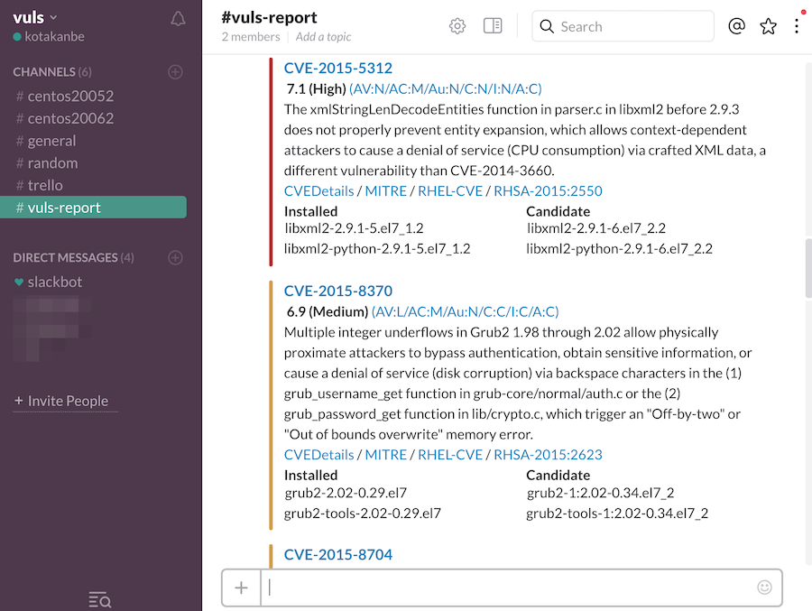
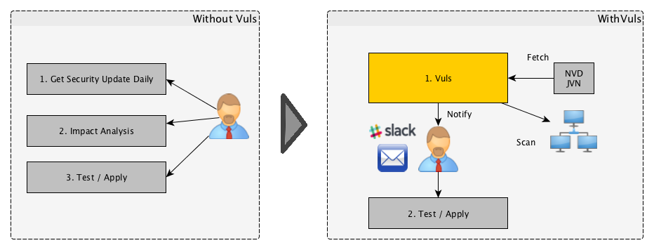
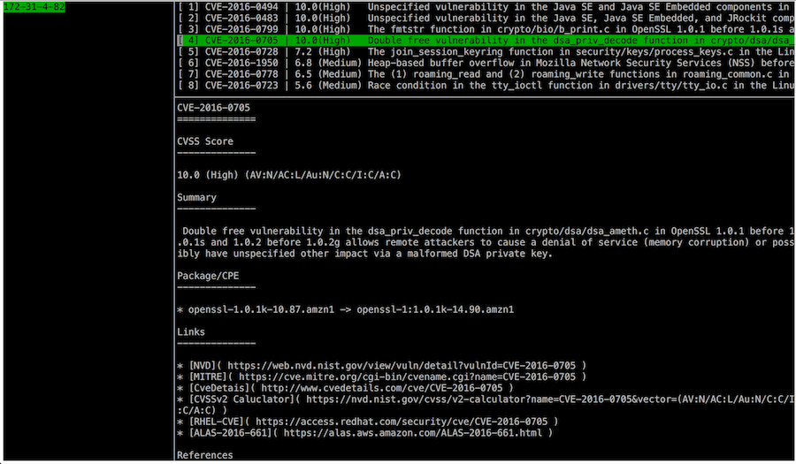
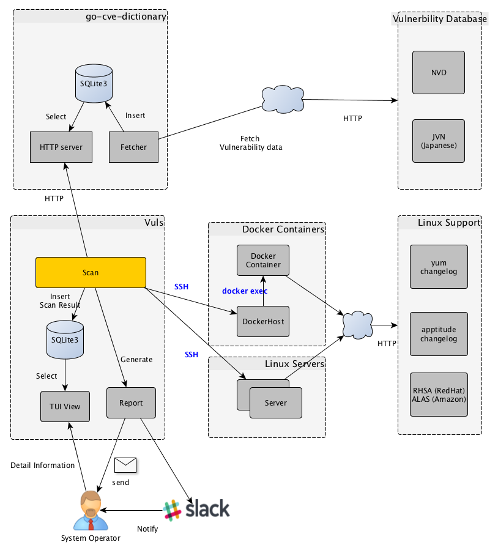
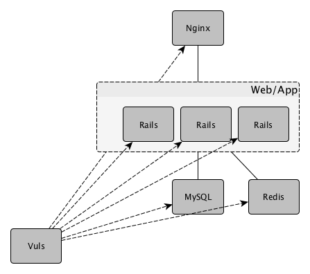
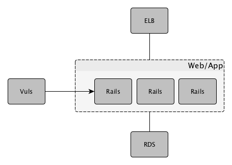

# Vuls: VULnerability Scanner

[](http://goo.gl/forms/xm5KFo35tu)

Vulnerability scanner for Linux, agentless, written in golang.

[README in Japanese](https://github.com/future-architect/vuls/blob/master/README.ja.md)

[](https://asciinema.org/a/3y9zrf950agiko7klg8abvyck)




----

# Abstract

毎日のように発見される脆弱性の調査やソフトウェアアップデート作業は、システム管理者にとって負荷の高いタスクである。
プロダクション環境ではサービス停止リスクを避けるために、パッケージマネージャの自動更新機能を使わずに手動更新で運用するケースも多い。
だが、手動更新での運用には以下の問題がある。
- システム管理者がNVDなどで新着の脆弱性をウォッチし続けなければならない
- サーバにインストールされているソフトウェアは膨大であり、システム管理者が全てを把握するのは困難
- 新着の脆弱性がどのサーバに該当するのかといった調査コストが大きく、漏れる可能性がある


Vulsは上に挙げた手動運用での課題を解決するツールであり、以下の特徴がある。
- システムに関係ある脆弱性のみ教えてくれる
- その脆弱性に該当するサーバを教えてくれる
- 自動スキャンのため脆弱性検知の漏れを防ぐことができる
- CRONなどで定期実行、レポートすることで脆弱性の放置を防ぐことできる



----

# Main Features

- Linuxサーバに存在する脆弱性をスキャン
    - Ubuntu, Debian, CentOS, Amazon Linux, RHELに対応
    - クラウド、オンプレミス、Docker
- OSパッケージ管理対象外のミドルウェアをスキャン
    - プログラミング言語のライブラリやフレームワーク、ミドルウェアの脆弱性スキャン
    - CPEに登録されているソフトウェアが対象
- エージェントレスアーキテクチャ
    - スキャン対象サーバにSSH接続可能なマシン1台にセットアップするだけで動作
- 設定ファイルのテンプレート自動生成
    - CIDRを指定してサーバを自動検出、設定ファイルのテンプレートを生成
- EmailやSlackで通知可能（日本語でのレポートも可能）
- 付属のTUIビューアを用いてターミナル上でスキャン結果を参照可能

----

# What Vuls Does'nt Do

- Vuls does'nt update the vulneable packages.

----

# Hello Vuls

Describe how to scan the vulnerabilites that is included on the localhost.
Procedure is as follows.

1. Launch Amazon Linux
1. Enable to ssh from localhost
1. Install requirements
1. Deploy go-cve-dictionary
1. Deploy Vuls
1. Configuration
1. Prepare
1. Scan
1. TUI(Terminal-Based User Interface)

## 1. Launch Amazon Linux

- For the purpose of explanation, using the old AMI (amzn-ami-hvm-2015.09.1.x86_64-gp2 - ami-383c1956)
- Instance size: t2.medium
    - Unable to work on t2.small, micro, nano, Because 2.3GB memory is needed during data fetch from NVD for the first time.
    - After the initial data fetch has been completed, It is able to run on t2.nano
- Add the following to the cloud-init, to prevent from automatically update at the first launch.

    - [Q: How do I disable the automatic installation of critical and important security updates on initial launch?](https://aws.amazon.com/amazon-linux-ami/faqs/?nc1=h_ls)
```
#cloud-config
repo_upgrade: none
```

## 2. Enable to ssh from localhost

Create a keypair then append public key to authorized_keys
```bash
$ ssh-keygen -t rsa
$ cat ~/.ssh/id_dsa.pub >> ~/.ssh/authorized_keys
```

## 3. Install requirements

Vuls requires the following packages.

- sqlite
- git
- gcc
- go v1.6
    - https://golang.org/doc/install

```bash
$ ssh ec2-user@52.100.100.100  -i ~/.ssh/private.pem
$ sudo yum -y install sqlite git gcc
$ wget https://storage.googleapis.com/golang/go1.6.linux-amd64.tar.gz
$ sudo tar -C /usr/local -xzf go1.6.linux-amd64.tar.gz
$ mkdir $HOME/go
```
Put these lines into /etc/profile.d/goenv.sh

```bash
export GOROOT=/usr/local/go
export GOPATH=$HOME/go
export PATH=$PATH:$GOROOT/bin:$GOPATH/bin
```

Set the OS environment variable to current shell
```bash
$ source /etc/profile.d/goenv.sh
```

## 4. Deploy go-cve-dictionary

go get

```bash
$ sudo mkdir /var/log/vuls
$ sudo chown ec2-user /var/log/vuls
$ sudo chmod 700 /var/log/vuls
$ go get github.com/kotakanbe/go-cve-dictionary
```

Start go-cve-dictionary as server mode.  
For the first time, go-cve-dictionary fetches vulnerability data from NVD.  
It takes about 10 minutes (on AWS).  

```bash
$ go-cve-dictionary server
... Fetching ...
$ ls -alh cve.sqlite3
-rw-r--r-- 1 ec2-user ec2-user 7.0M Mar 24 13:20 cve.sqlite3
```

Now we has vulnerbility data, So start as server mode again.
```bash
$ go-cve-dictionary server
[Mar 24 15:21:55]  INFO Opening DB. datafile: /home/ec2-user/cve.sqlite3
[Mar 24 15:21:55]  INFO Migrating DB
[Mar 24 15:21:56]  INFO Starting HTTP Sever...
[Mar 24 15:21:56]  INFO Listening on 127.0.0.1:1323
```

## 5. Deploy vuls

Launch a new terminal, SSH to the ec2.

go get
```
$ go get github.com/future-architect/vuls
```

## 6. Config

Create a config file(TOML format).

```
$ cat config.toml
[servers]

[servers.172-31-4-82]
host         = "172.31.4.82"
port        = "22"
user        = "ec2-user"
keyPath     = "/home/ec2-user/.ssh/id_rsa"
```

## 7. Prepare


```
$ vuls prepare
```

## 8. Scan

```
$ vuls scan
INFO[0000] Begin scannig (config: /home/ec2-user/config.toml)

... snip ...

172-31-4-82 (amazon 2015.09)
============================
CVE-2016-0494   10.0    Unspecified vulnerability in the Java SE and Java SE Embedded components in Oracle
                        Java SE 6u105, 7u91, and 8u66 and Java SE Embedded 8u65 allows remote attackers to
                        affect confidentiality, integrity, and availability via unknown vectors related to
                        2D.
... snip ...

CVE-2016-0494
-------------
Score           10.0 (High)
Vector          (AV:N/AC:L/Au:N/C:C/I:C/A:C)
Summary         Unspecified vulnerability in the Java SE and Java SE Embedded components in Oracle Java SE 6u105,
                7u91, and 8u66 and Java SE Embedded 8u65 allows remote attackers to affect confidentiality,
                integrity, and availability via unknown vectors related to 2D.
NVD             https://web.nvd.nist.gov/view/vuln/detail?vulnId=CVE-2016-0494
MITRE           https://cve.mitre.org/cgi-bin/cvename.cgi?name=CVE-2016-0494
CVE Details     http://www.cvedetails.com/cve/CVE-2016-0494
CVSS Claculator https://nvd.nist.gov/cvss/v2-calculator?name=CVE-2016-0494&vector=(AV:N/AC:L/Au:N/C:C/I:C/A:C)
RHEL-CVE        https://access.redhat.com/security/cve/CVE-2016-0494
ALAS-2016-643   https://alas.aws.amazon.com/ALAS-2016-643.html
Package/CPE     java-1.7.0-openjdk-1.7.0.91-2.6.2.2.63.amzn1 -> java-1.7.0-openjdk-1:1.7.0.95-2.6.4.0.65.amzn1

```

## 9. TUI

Vuls has Terminal-Based User Interface to see the latest scan.

```
$ vuls tui
```




----

# Architecture



## go-cve-dictinary  
- Fetch vulnerbility information from NVD, JVN(Japanese), then insert into SQLite.

## Vuls
- Scan vulnerabilities that exist on servers, to get a list of the CVE ID
- In order to get more information of the detected CVE, send HTTP request to go-cve-dictinary
- Send the report by Slack, Email
- System operator can see the latest report by terminal

----

# Usecase

## Scan all servers



## Scan a single server

web/app server in the same configuration under the load balancer



----

# Support OS

| Distribution|            Release |
|:------------|-------------------:|
| Ubuntu      |          12, 14, 16|
| Debian      |                7, 8|
| RHEL        |          4, 5, 6, 7|
| CentOS      |             5, 6, 7|
| Amazon Linux|                All |

----


# Usage: Automatic Server Discovery

Discovery subcommand discovers active servers which specifed in CIDR range, then print the template of config file(TOML format) to terminal.

```
$ vuls discover -help
discover:
        discover 192.168.0.0/24
```

## Exapmle

```
$ vuls discover 172.31.4.0/24
# Create config.toml using below and then ./vuls --config=/path/to/config.toml

[slack]
hookURL      = "https://hooks.slack.com/services/abc123/defghijklmnopqrstuvwxyz"
channel      = "#channel-name"
#channel      = "#{servername}"
iconEmoji    = ":ghost:"
authUser     = "username"
notifyUsers  = ["@username"]

[mail]
smtpAddr      = "smtp.gmail.com"
smtpPort      = 465
user          = "username"
password      = "password"
from          = "from@address.com"
to            = ["to@address.com"]
cc            = ["cc@address.com"]
subjectPrefix = "[vuls]"

[default]
#port        = "22"
#user        = "username"
#password    = "password"
#keyPath     = "/home/username/.ssh/id_rsa"
#keyPassword = "password"

[servers]

[servers.172-31-4-82]
host         = "172.31.4.82"
#port        = "22"
#user        = "root"
#password    = "password"
#keyPath     = "/home/username/.ssh/id_rsa"
#keyPassword = "password"
#cpeNames = [
#  "cpe:/a:rubyonrails:ruby_on_rails:4.2.1",
#]
```

You can customize your configuration using this template.

----

# Configuration

- Slack section
    ```
    [slack]
    hookURL      = "https://hooks.slack.com/services/abc123/defghijklmnopqrstuvwxyz"
    channel      = "#channel-name"
    #channel      = "#{servername}"
    iconEmoji    = ":ghost:"
    authUser     = "username"
    notifyUsers  = ["@username"]
    ```

    - hookURL : Incomming webhook's URL  
    - channel : channel name.  
    If you set #{servername} to channel, the report will be sent to #servername channel.  
    In the following example, the report will be sent to #server1 and #server2.  
    Be sure to create these channels before scanning.
      ```
      [slack]
      channel      = "#{servername}"
      ...snip...

      [servers]

      [servers.server1]
      host         = "172.31.4.82"
      ...snip...

      [servers.server2]
      host         = "172.31.4.83"
      ...snip...
      ```

    - iconEmoji: emoji
    - authUser: username of the slack team
    - notifyUsers: a list of Slack usernames to send Slack notification.
      If you set ["@foo", "@bar"] to notifyUsers, @foo @bar will be included in text.  
      So @foo, @bar can receive mobile push notifications on their smartphone.  

- Mail section
    ```
    [mail]
    smtpAddr      = "smtp.gmail.com"
    smtpPort      = 465
    user          = "username"
    password      = "password"
    from          = "from@address.com"
    to            = ["to@address.com"]
    cc            = ["cc@address.com"]
    subjectPrefix = "[vuls]"
    ```

- Defualt section
    ```
    [default]
    #port        = "22"
    #user        = "username"
    #password    = "password"
    #keyPath     = "/home/username/.ssh/id_rsa"
    #keyPassword = "password"
    ```
    Items that are not specified in the server section will be set those items of the defualt section.

- servers section
    ```
    [servers]

    [servers.172-31-4-82]
    host         = "172.31.4.82"
    #port        = "22"
    #user        = "root"
    #password    = "password"
    #keyPath     = "/home/username/.ssh/id_rsa"
    #keyPassword = "password"
    #cpeNames = [
    #  "cpe:/a:rubyonrails:ruby_on_rails:4.2.1",
    #]
    ```
    You can overwrite the default value that specified in default section.  
    Vuls supports multiple SSH authentication method.  
    - SSH agent
    - SSH public key authentication (with password, empty password)
    - Password authentication

----

# Usage: Prepare

Prepare subcommand installs required packages on each server.

| Distribution|            Release | Requirements |
|:------------|-------------------:|:-------------|
| Ubuntu      |          12, 14, 16| -            |
| Debian      |                7, 8| apptitude    |
| CentOS      |                   5| yum-plugin-security, yum-changelog |
| CentOS      |                6, 7| yum-plugin-security, yum-plugin-changelog |
| Amazon      |                All | -            |
| RHEL        |         4, 5, 6, 7 | -            |


```
$ vuls prepare -help
prepare:
        prepare [-config=/path/to/config.toml] [-debug]

  -config string
        /path/to/toml (default "$PWD/config.toml")
  -debug
        debug mode
  -use-unattended-upgrades
        [Depricated] For Ubuntu, install unattended-upgrades
```

----

# Usage: Scan

```
$ vuls scan -help
scan:
        scan
                [-lang=en|ja]
                [-config=/path/to/config.toml]
                [-dbpath=/path/to/vuls.sqlite3]
                [-cve-dictionary-url=http://127.0.0.1:1323]
                [-cvss-over=7]
                [-report-slack]
                [-report-mail]
                [-http-proxy=http://192.168.0.1:8080]
                [-debug]
                [-debug-sql]
  -config string
        /path/to/toml (default "$PWD/config.toml")
  -cve-dictionary-url string
        http://CVE.Dictionary (default "http://127.0.0.1:1323")
  -cvss-over float
        -cvss-over=6.5 means reporting CVSS Score 6.5 and over (default: 0 (means report all))
  -dbpath string
        /path/to/sqlite3 (default "$PWD/vuls.sqlite3")
  -debug
        debug mode
  -debug-sql
        SQL debug mode
  -http-proxy string
        http://proxy-url:port (default: empty)
  -lang string
        [en|ja] (default "en")
  -report-mail
        Email report
  -report-slack
        Slack report
  -use-unattended-upgrades
        [Depricated] For Ubuntu. Scan by unattended-upgrades or not (use apt-get upgrade --dry-run by default)
  -use-yum-plugin-security
        [Depricated] For CentOS 5. Scan by yum-plugin-security or not (use yum check-update by default)

```

## example

Run go-cve-dictionary as server mdoe before scanning.
```
$ go-cve-dictionary server
```

### Scan all servers defined in config file
```
$ vuls scan --report-slack --report-mail --cvss-over=7
```
Examples of the above are the following meanings...
- Scan all servers defined in config file
- Send scan resulsts to slack, email
- Only Reporting CVEs that CVSS score over 7
- Print scan result to terminal

### Scan specified servers
```
$ vuls scan server1 server2
```
Examples of the above are the following meanings...
- Scan only 2 servers. (server1, server2)
- Print scan result to terminal

----

# Usage: Scan vulnerability of non-OS package

Vuls is possible to detect vulnerabilities something you compiled by yourself or library of language, framework that has been registered in the [CPE](https://nvd.nist.gov/cpe.cfm).

-  How to search CPE name by software name
    - [NVD: Search Common Platform Enumerations (CPE)](https://web.nvd.nist.gov/view/cpe/search)  
    **Check CPE Naming Format: 2.2**

- Configuration  
If you want to detect the vulnerbility of Ruby on Rails v4.2.1, define as below.
    ```
    [servers]

    [servers.172-31-4-82]
    host         = "172.31.4.82"
    user        = "ec2-user"
    keyPath     = "/home/username/.ssh/id_rsa"
    cpeNames = [
      "cpe:/a:rubyonrails:ruby_on_rails:4.2.1",
    ]
    ```

# Usage: Update NVD Data.

```
$ go-cve-dictionary fetchnvd -h
fetchnvd:
        fetchnvd
                [-last2y]
                [-dbpath=/path/to/cve.sqlite3]
                [-debug]
                [-debug-sql]

  -dbpath string
        /path/to/sqlite3 (default "$PWD/cve.sqlite3")
  -debug
        debug mode
  -debug-sql
        SQL debug mode
  -last2y
        Refresh NVD data in the last two years.
```

- Fetch data of the entire period

```
$ go-cve-dictionary fetchnvd -entire
```

- Fetch data last 2 years

```
$ go-cve-dictionary fetchnvd -last2y
```

----

# Misc

- HTTP Proxy Support  
If your system is behind HTTP proxy, you have to specify --http-proxy option.

- How to Daemonize go-cve-dictionary  
Use Systemd, Upstart or supervisord, daemontools...

- How to update vulnerbility data automatically.  
Use job scheduler like Cron (with -last2y option).

- How to cross compile
    ```bash
    $ cd /path/to/your/local-git-reporsitory/vuls
    $ GOOS=linux GOARCH=amd64 go build -o vuls.amd64
    ```

- Logging  
Log wrote to under /var/log/vuls/

- Debug  
Run with --debug, --sql-debug option.

- Windows  
Use Microsoft Baseline Secuirty Analyzer. [MBSA](https://technet.microsoft.com/en-us/security/cc184924.aspx)

----

# Data Source

- [NVD](https://nvd.nist.gov/)
- [JVN(Japanese)](http://jvndb.jvn.jp/apis/myjvn/)


# Authors

kotakanbe ([@kotakanbe](https://twitter.com/kotakanbe)) created vuls and [these fine people](https://github.com/future-architect/vuls/graphs/contributors) have contributed.

----

# Contribute

1. Fork it
2. Create your feature branch (`git checkout -b my-new-feature`)
3. Commit your changes (`git commit -am 'Add some feature'`)
4. Push to the branch (`git push origin my-new-feature`)
5. Create new Pull Request

----

# Change Log

Please see [CHANGELOG](https://github.com/future-architect/vuls/blob/master/CHANGELOG.md).

----

# Licence

Please see [LICENSE](https://github.com/future-architect/vuls/blob/master/LICENSE).


[](https://bitdeli.com/free "Bitdeli Badge")

