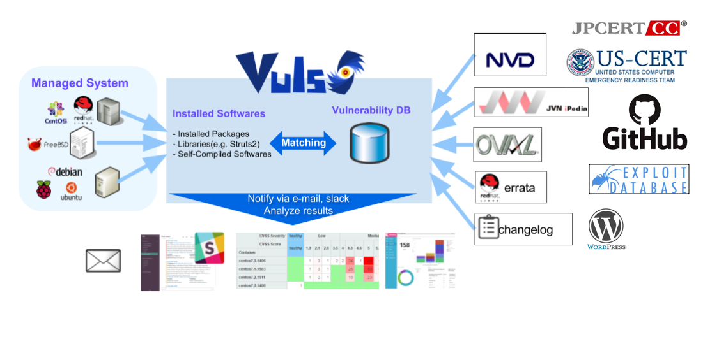

# Vuls: VULnerability Scanner

  

Vulnerability scanner for Linux/FreeBSD, agentless, written in golang.  
We have a slack team. [Join slack team](http://goo.gl/forms/xm5KFo35tu)  
Twitter: [@vuls_en](https://twitter.com/vuls_en)

----

# Abstract

For a system administrator, having to perform security vulnerability analysis and software update on a daily basis can be a burden.
To avoid downtime in production environment, it is common for system administrator to choose not to use the automatic update option provided by package manager and to perform update manually.
This leads to the following problems.
- System administrator will have to constantly watch out for any new vulnerabilities in NVD(National Vulnerability Database) or similar databases.
- It might be impossible for the system administrator to monitor all the software if there are a large number of software installed in server.
- It is expensive to perform analysis to determine the servers affected by new vulnerabilities. The possibility of overlooking a server or two during analysis is there.

Vuls is a tool created to solve the problems listed above. It has the following characteristics.
- Informs users of the vulnerabilities that are related to the system.
- Informs users of the servers that are affected.
- Vulnerability detection is done automatically to prevent any oversight.
- Report is generated on regular basis using CRON or other methods. to manage vulnerability.

----

# Main Features

- Scan for any vulnerabilities in Linux/FreeBSD Server
    - Supports Alpine, Ubuntu, Debian, CentOS, Amazon Linux, RHEL, Oracle Linux, SUSE Enterprise Linux and Raspbian, FreeBSD
    - Cloud, on-premise, Docker
- High quality scan
    - Vuls uses Multiple vulnerability databases
        - [NVD](https://nvd.nist.gov/)
        - [JVN(Japanese)](http://jvndb.jvn.jp/apis/myjvn/)
        - [RedHat](https://www.redhat.com/security/data/oval/)
        - [Debian](https://www.debian.org/security/oval/)
        - [Ubuntu](https://people.canonical.com/~ubuntu-security/oval/)
        - [SUSE](http://ftp.suse.com/pub/projects/security/oval/)
        - [Oracle Linux](https://linux.oracle.com/security/oval/)
        - [Alpine-secdb](https://git.alpinelinux.org/cgit/alpine-secdb/)
        - RHSA/ALAS/ELSA/FreeBSD-SA
        - Changelog
- Fast scan and Deep scan
    - Fast Scan
        - Scan without root privilege
        - Scan with No internet access. (RedHat, CentOS, OracleLinux, Ubuntu, Debian)
        - Almost no load on the scan target server
    - Deep Scan
        - Scan with root privilege
        - Parses the Changelog  
            Changelog has a history of version changes. When a security issue is fixed, the relevant CVE ID is listed.
            By parsing the changelog and analysing the updates between the installed version of software on the server and the newest version of that software
            it's possible to create a list of all vulnerabilities that need to be fixed.
        - Sometimes load on the scan target server
- Remote scan and Local scan
    - Remote Scan
        - User is required to only setup one machine that is connected to other target servers via SSH
    - Local Scan 
        - If you don't want the central Vuls server to connect to each server by SSH, you can use Vuls in the Local Scan mode.
- **Dynamic** Analysis
    - It is possible to acquire the state of the server by connecting via SSH and executing the command
        - Vuls warns when the scan target server was updated the kernel etc. but not restarting it.
- Scan middleware that are not included in OS package management
    - Scan middleware, programming language libraries and framework for vulnerability
    - Support software registered in CPE
- Nondestructive testing
- Pre-authorization is *NOT* necessary before scanning on AWS
    - Vuls works well with Continuous Integration since tests can be run every day. This allows you to find vulnerabilities very quickly.
- Auto generation of configuration file template
    - Auto detection of servers set using CIDR, generate configuration file template
- Email and Slack notification is possible (supports Japanese language)
- Scan result is viewable on accessory software, TUI Viewer on terminal or Web UI ([VulsRepo](https://github.com/usiusi360/vulsrepo)).

----

# What Vuls Doesn't Do

- Vuls doesn't update the vulnerable packages.

----

# Document

For more information such as Installation, Tutorial, Usage, visit [vuls.io](https://vuls.io/)  
[日本語翻訳ドキュメント](https://vuls.io/ja/)

----

# Authors

kotakanbe ([@kotakanbe](https://twitter.com/kotakanbe)) created vuls and [these fine people](https://github.com/future-architect/vuls/graphs/contributors) have contributed.

----

# Change Log

Please see [CHANGELOG](https://github.com/future-architect/vuls/blob/master/CHANGELOG.md).

----
# Stargazers over time		
		
		

-----

# License

Please see [LICENSE](https://github.com/future-architect/vuls/blob/master/LICENSE).
